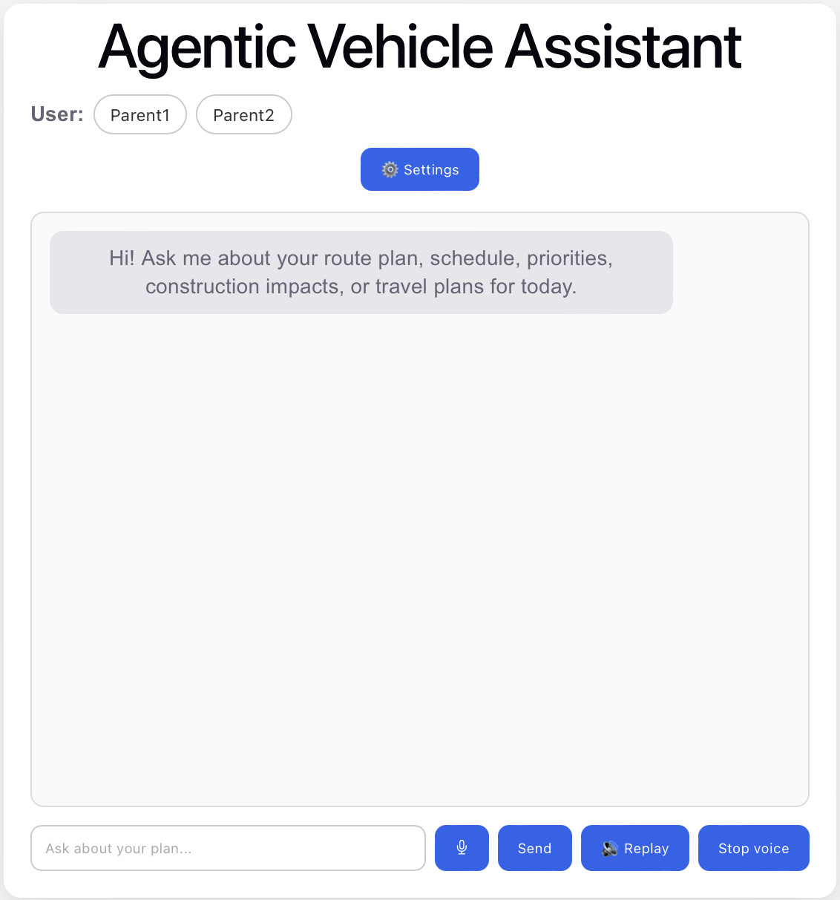
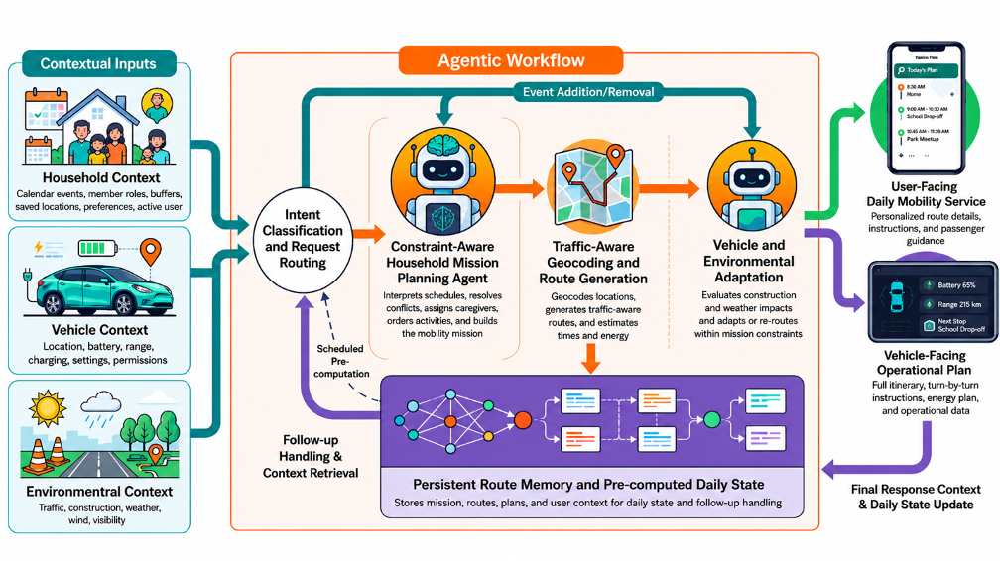
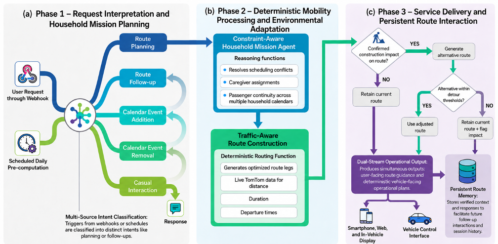
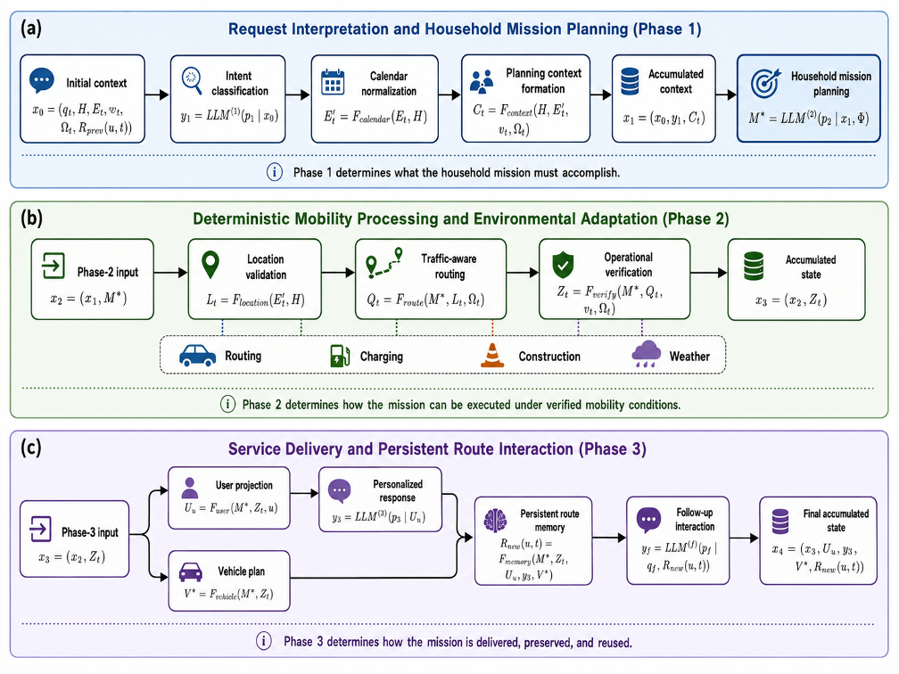
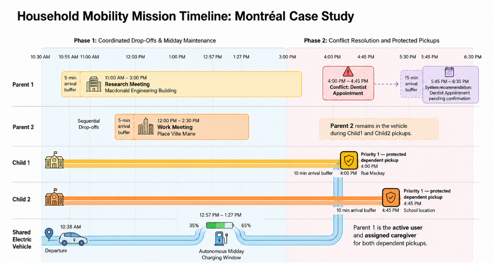
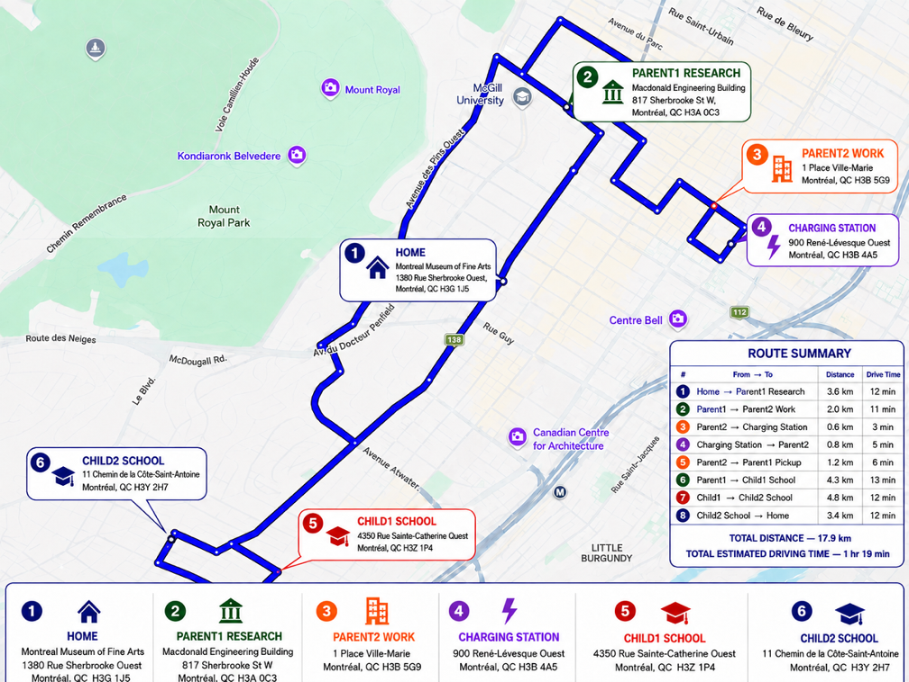
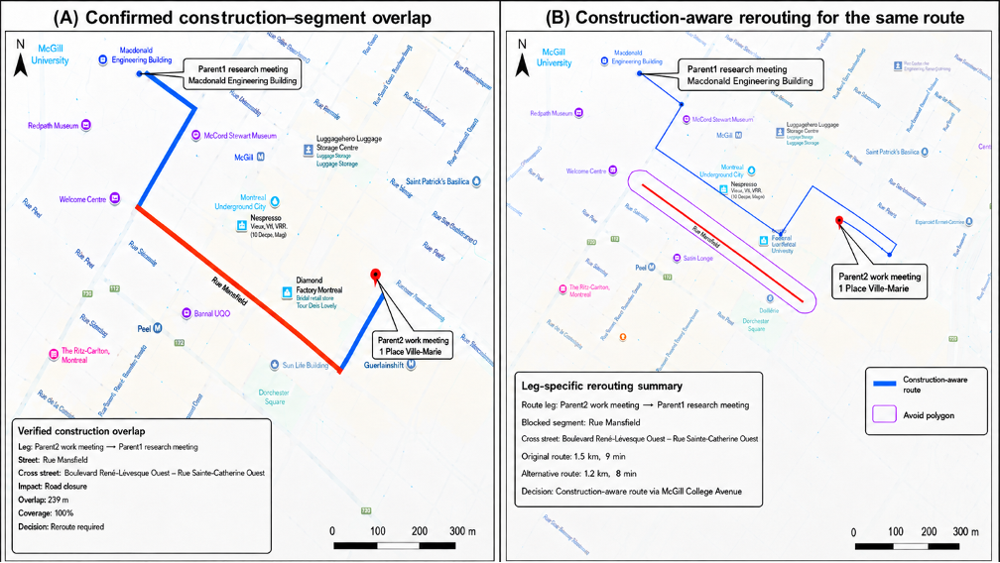

# Agentic Mobility Assistant

A context-aware agentic AI system for coordinating daily household mobility using a shared autonomous electric vehicle.


**[Open the Agentic Mobility Assistant](https://agentic-vehicle-assistant.vercel.app/)**



## Overview

The **Agentic Mobility Assistant** is a context-aware daily mobility planning system designed to coordinate the transportation needs of a household sharing a single electric vehicle.

Rather than planning individual trips independently, the system constructs a **continuous household mobility mission** that coordinates multiple caregivers, dependents, calendar commitments, vehicle operations, and changing environmental conditions.

The system combines **bounded large language model (LLM) agents** with **deterministic mobility-processing components**. LLMs are used for tasks requiring interpretation and contextual reasoning, while externally verifiable operations such as routing, geocoding, traffic analysis, calendar processing, and state management remain deterministic.

The system considers:

* Multiple household calendars
* Caregiver and dependent transportation responsibilities
* Protected events such as school pickups
* Shared-vehicle availability
* Passenger continuity
* Electric-vehicle battery state and charging
* Traffic-aware route generation
* Road construction
* Weather conditions
* Personalized route information
* Persistent route memory
* User-facing and vehicle-facing outputs

---

## System Framework

The prototype was implemented using **n8n** and connected to a **React-based conversational interface** through webhooks.

The architecture combines four main elements:

1. **Contextual Data Sources**
2. **Bounded LLM Agents**
3. **Deterministic Mobility Processing**
4. **Persistent Route Memory and Service Delivery**



### Contextual Inputs

The workflow considers three categories of context.

**Household Context**

* Calendar events
* Household-member roles
* Caregiver responsibilities
* Saved locations
* Arrival buffers
* Active user
* Display preferences

**Vehicle Context**

* Vehicle location
* Battery state
* Estimated range
* Charging configuration
* Vehicle permissions
* Return-home settings

**Environmental Context**

* Traffic conditions
* Road construction
* Weather
* Wind
* Visibility

Together, these inputs provide the information needed to construct and verify the daily household mobility mission.

---

## Agentic Workflow

Incoming requests are routed through an intent-guided workflow.



The Intent Classification Agent assigns requests to one of five service intents:

* Route planning
* Route follow-up
* Calendar-event addition
* Calendar-event removal
* Casual interaction

Only requests requiring a new mobility plan activate the complete route-generation workflow.

Follow-up requests can instead retrieve information from persistent route memory without repeating calendar retrieval, geocoding, routing, construction analysis, and vehicle planning.

---

## Agent Roles

### Intent Classification Agent

Determines which workflow branch should process the incoming request.

It distinguishes between:

* New route-generation requests
* Questions about an existing route
* Calendar modifications
* Casual conversation

### Constraint-Aware Household Mission Planning Agent

Performs the primary household-level reasoning.

The agent:

* Interprets household schedules
* Determines which events require transportation
* Identifies event priorities
* Preserves protected dependent responsibilities
* Detects scheduling conflicts
* Assigns caregivers
* Orders transportation activities
* Maintains pickup and passenger relationships
* Constructs the household mobility mission

The agent does **not** independently generate geographic coordinates, route geometry, or travel times. These operations are performed by deterministic mobility-processing components.

### Calendar Event Extractor Agents

Dedicated agents convert natural-language requests into structured information for:

* Calendar-event addition
* Calendar-event removal

Missing or ambiguous information requires clarification before the calendar is modified.

### Final Route Agent

Converts verified route information into personalized user-facing guidance.

It receives already verified information including:

* Route legs
* Departure and arrival times
* Traffic conditions
* Construction impacts
* Scheduling decisions
* Weather context
* Vehicle information

The Final Route Agent communicates the selected mission without independently recalculating the route or altering the event sequence.

---

## Three-Phase Methodology

The complete planning process is organized into three functional phases.



### Phase 1 — Request Interpretation and Household Mission Planning

Phase 1 determines **what the household mission must accomplish**.

The system:

* Receives the user request
* Classifies the request intent
* Retrieves and normalizes household calendar events
* Combines household, vehicle, and schedule information
* Identifies transportation requirements
* Detects scheduling conflicts
* Assigns caregiver responsibilities
* Preserves protected events
* Constructs the ordered household mobility mission

At this stage, the logical structure of the day is determined, but externally verifiable route information has not yet been calculated.

### Phase 2 — Deterministic Mobility Processing and Environmental Adaptation

Phase 2 determines **how the mission can be executed under verified mobility conditions**.

Deterministic components perform:

* Location validation
* Geocoding
* Traffic-aware route generation
* Distance calculation
* Travel-time calculation
* Departure-time calculation
* Electric-vehicle battery evaluation
* Charging coordination
* Charging-station selection
* Construction verification
* Construction-aware rerouting
* Weather retrieval
* Operational verification

This separates contextual LLM reasoning from mobility information that can be calculated or verified using external services.

### Phase 3 — Service Delivery and Persistent Route Interaction

Phase 3 determines **how the mission is delivered, preserved, and reused**.

The verified household mission is transformed into:

* Personalized guidance for the active household user
* A complete vehicle-facing operational plan
* A persistent route-memory record

The stored route can then support later questions without rerunning the entire planning workflow.

---

## Key Features

### Multi-Calendar Household Planning

The assistant coordinates events belonging to multiple household members rather than planning around one user's calendar in isolation.

### Shared-Vehicle Mission Planning

Transportation responsibilities are coordinated through one shared vehicle.

The system therefore maintains vehicle continuity across the full day instead of optimizing each trip independently.

### Protected Event Prioritization

High-priority responsibilities such as dependent school pickups are protected.

When a lower-priority event conflicts with a protected responsibility, the system can recommend modifying the lower-priority event instead.

### Caregiver Assignment

The workflow determines which caregiver should perform dependent transportation while considering:

* Caregiver schedules
* Shared-vehicle availability
* Event priorities
* Existing responsibilities
* Passenger state

### Passenger Continuity

Dependents are tracked after pickup so that subsequent vehicle movements remain consistent with the household passenger state.

### Traffic-Aware Routing

TomTom services provide operational route information including:

* Travel distance
* Live travel time
* No-traffic travel time
* Traffic delay
* Departure time
* Arrival time
* Street information
* Route geometry

### Construction-Aware Adaptation

Generated routes are compared with Montréal construction records.

Construction impacts are verified against the reported construction boundaries and route geometry before a route is changed.

### Electric-Vehicle Charging Coordination

The system evaluates:

* Current battery percentage
* Preferred minimum battery threshold
* Critical battery threshold
* Estimated remaining range
* Available charging opportunities
* Charging-station feasibility

When appropriate, autonomous passenger-free charging can be inserted into the daily vehicle mission without disrupting protected household events.

### Persistent Route Memory

Verified daily mobility missions are stored using the active user and planning date.

Users can then ask follow-up questions such as:

```text
What time should I leave?
```

```text
What is my plan today?
```

```text
When will the vehicle charge?
```

```text
Is there traffic on my route?
```

```text
Is there construction?
```

These questions can be answered from the previously generated route without rebuilding the complete mobility mission.

### Calendar Modification

The assistant also supports conversational calendar modifications.

For example:

```text
Add a dentist appointment tomorrow at 4 PM.
```

or:

```text
Remove my afternoon meeting.
```

After the calendar is modified, the household mobility mission can be recalculated using the updated schedule.

---

## Montréal Case Study

The system was evaluated using a controlled Montréal household scenario consisting of:

* Two caregivers
* Two dependents
* One shared electric vehicle
* Work and research commitments
* Two protected school pickups
* A conflicting medical appointment
* A midday EV charging requirement

The scenario requires several scheduling, caregiver, passenger, and vehicle constraints to be coordinated during the same day.



The medical appointment conflicts with the protected dependent pickups, requiring the system to determine which activities should remain fixed and which may be rescheduled.

The vehicle also begins below its preferred battery threshold, creating an additional charging requirement that must be coordinated with the household schedule.

---

## Generated Household Mobility Mission

The proposed system transforms the household schedule into one continuous shared-vehicle mission.



The generated mission contains **eight vehicle legs**, covers approximately **17.9 km**, and requires an estimated **1 hour and 19 minutes of total driving time**.

The mobility mission coordinates travel between:

* Home
* Parent1's research meeting
* Parent2's work meeting
* The charging station
* Parent2 pickup
* Parent1 pickup
* Child1's school
* Child2's school
* Home

The resulting plan successfully:

* Preserved both protected dependent pickups
* Maintained Parent1's pickup responsibility
* Coordinated both caregivers through one shared vehicle
* Maintained passenger continuity
* Inserted autonomous charging during the available midday period
* Detected the conflicting medical appointment
* Recommended rescheduling the medical appointment rather than disrupting the protected pickups

---

## Construction-Aware Rerouting

The case study also demonstrates environmental adaptation when construction affects a generated route.



The original route between Parent2's work meeting and Parent1's research meeting overlapped a reported construction-affected segment of **Rue Mansfield**.

The system:

1. Detects the potential construction overlap
2. Verifies the affected segment against the route geometry
3. Generates an alternative route
4. Evaluates whether the alternative remains within the configured detour limits
5. Retains the adjusted route when it remains operationally acceptable

In the case study, the verified alternative redirected the vehicle through **McGill College Avenue**.

---

## Evaluation

The system was evaluated from two perspectives:

1. **Architectural capability**
2. **LLM performance within the same workflow**

### Architectural Ablation

The proposed system was compared with two reduced generalist-agent configurations while using GPT-5.2 in all three conditions.

| Architecture                                      | Successful Runs | Mean Route Accuracy |
| ------------------------------------------------- | --------------: | ------------------: |
| **Proposed Agentic Architecture**                 |             3/3 |          **94.44%** |
| Intent-Guided LLM-Only Planning Baseline          |             3/3 |              75.00% |
| Calendar-Tool Agent Without Intent Classification |             3/3 |              72.22% |

The largest performance differences occurred in:

* Alternative recommendation quality
* Active-user filtering
* Schedule feasibility

The reduced configurations were faster because they performed substantially fewer operations.

However, they did not reproduce the complete capabilities of the proposed architecture, including:

* Traffic-aware routing
* Construction verification
* Charging coordination
* Deterministic mission processing
* Active-user filtering
* Persistent route memory

---

## LLM Evaluation

Multiple GPT and Gemini models were evaluated while keeping the surrounding workflow, household scenario, deterministic mobility-processing stages, external services, and evaluation procedure fixed.

The evaluated models included:

* GPT-5.6 Sol
* GPT-5.5
* GPT-5.4 mini
* GPT-5.2
* GPT-5 mini
* GPT-4.1 mini
* Gemini 3.1 Pro Preview
* Gemini 3.6 Flash

For initial route generation:

* **GPT-5.2** achieved **94.44% mean route accuracy** with a mean response time of approximately **119 seconds**
* **Gemini 3.1 Pro Preview** also achieved **94.44% mean route accuracy**, but required approximately **232 seconds**
* **Gemini 3.6 Flash** achieved **88.89% mean route accuracy** and the highest overall composite score of **0.896**

These results show that model selection depends on more than route accuracy alone.

### Route-Memory Follow-Up

Model performance also differed during shorter route-memory interactions.

**GPT-5.5** and **GPT-5.6 Sol** achieved:

* **100% factual accuracy**
* **100% route-memory accuracy**

across the evaluated follow-up questions.

This indicates that the most suitable model may depend on the specific reasoning task being performed within the overall system.

---

## Technologies

### Frontend

* React
* Vite
* JavaScript
* HTML
* CSS

### Agentic Workflow

* n8n
* Large Language Models
* Agentic AI
* Prompt Engineering
* Structured JSON communication
* Persistent workflow state

### AI Models Evaluated

* GPT-5.6 Sol
* GPT-5.5
* GPT-5.4 mini
* GPT-5.2
* GPT-5 mini
* GPT-4.1 mini
* Gemini 3.1 Pro Preview
* Gemini 3.6 Flash

### Mobility and Context Services

* Google Calendar
* TomTom Routing
* TomTom Geocoding
* TomTom Traffic
* Montréal Open Data
* Circuit électrique charging data
* Weather services

### Development

* Git
* GitHub
* REST APIs
* JSON

---

## Repository Structure

```text
agentic-mobility-assistant/
│
├── src/
│   ├── api/
│   ├── assets/
│   ├── components/
│   └── App.jsx
│
├── public/
│
├── docs/
│   └── images/
│       ├── application-interface.png
│       ├── system-framework.png
│       ├── service-workflow.png
│       ├── methodology-progression.png
│       ├── household-timeline.png
│       ├── household-route.png
│       └── construction-rerouting.png
│
├── agentic-mobility-assistant-workflow-public.json
├── package.json
├── vite.config.js
└── README.md
```

---

## n8n Workflow

A sanitized version of the main Agentic Mobility Assistant workflow is included in:

```text
agentic-mobility-assistant-workflow-public.json
```

The public workflow preserves the workflow architecture and processing logic while removing private credentials and deployment-specific information.

Users importing the workflow must configure their own:

* OpenAI credentials
* Google Calendar credentials
* TomTom API credentials
* Weather-service credentials
* n8n data tables
* Household settings

---

## Running the Frontend

Install the project dependencies:

```bash
npm install
```

Start the development server:

```bash
npm run dev
```

The React application communicates with the n8n workflow through a webhook endpoint.

A configured n8n environment and the required external services are necessary for the complete application to function.

---

## Research

This repository supports the research project:

### Design and Development of an Agentic System for Context-Aware Daily Mobility Services

The research investigates how bounded LLM reasoning, deterministic transportation processing, environmental information, and persistent operational state can be combined to support continuous household mobility planning.

The work evaluates:

* Household shared-vehicle coordination
* Multi-calendar planning
* Agentic workflow architecture
* Deterministic mobility processing
* Traffic-aware routing
* Construction-aware adaptation
* EV charging coordination
* Persistent route memory
* LLM accuracy and latency
* Architectural capability ablation

---

## Limitations and Future Work

The current prototype was evaluated using one fixed Montréal household configuration involving two caregivers, two dependents, and one shared electric vehicle.

The vehicle-facing operational plan is currently a simulated workflow output rather than a direct interface with a deployed autonomous vehicle.

Future development could include:

* Additional household configurations
* Multiple shared vehicles
* Larger numbers of evaluation scenarios
* Additional repeated LLM trials
* Component-level architectural ablations
* More explicit passenger boarding and occupancy state
* Live vehicle telemetry
* Dynamic replanning when traffic conditions change
* Automatic response to newly reported construction
* Replanning after unexpected calendar delays
* Real-time battery and charging updates

---

## Privacy and Security

The public repository should not contain:

* API keys
* Authentication tokens
* Real household calendar information
* Private addresses
* Private n8n credentials
* Unsanitized workflow exports

The included public n8n workflow has been sanitized and requires users to connect their own credentials and external services.

---

## Author

**Olivia Cardillo**

McGill University
